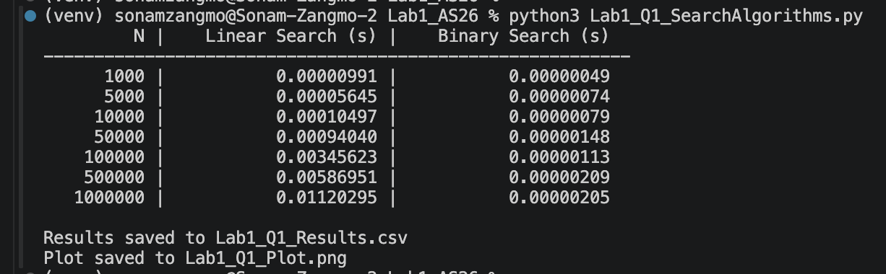
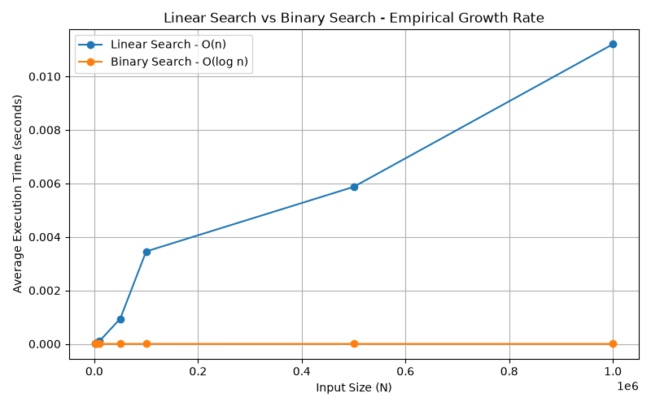
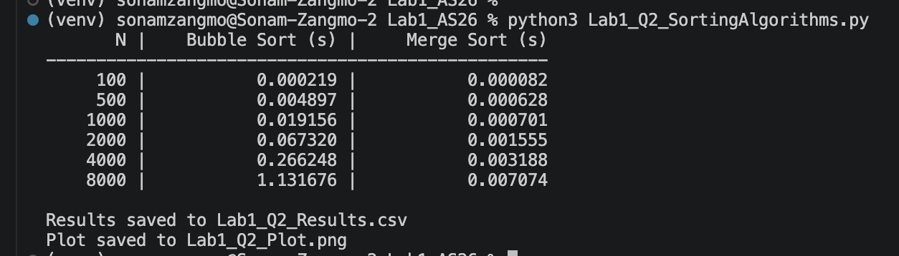
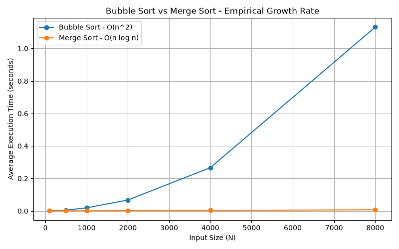
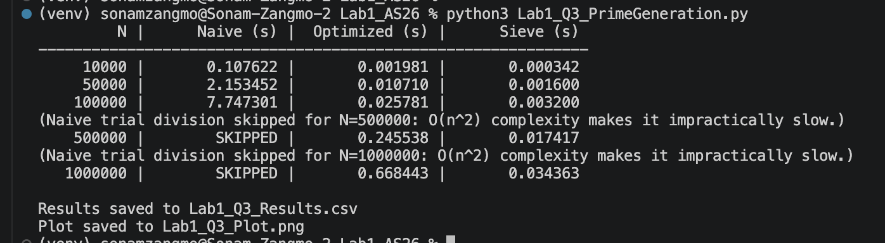
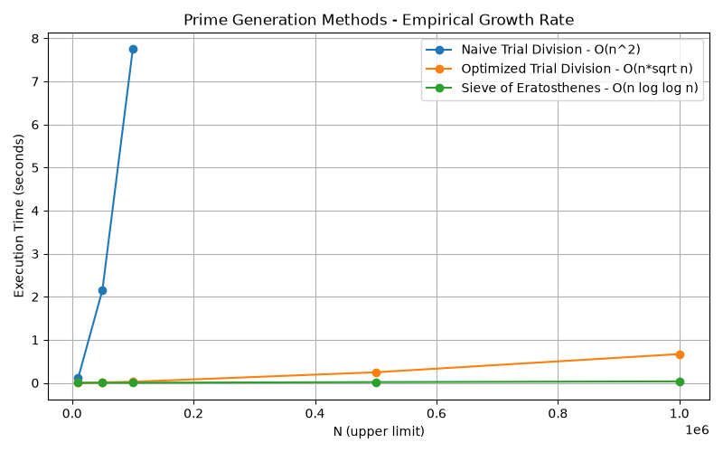

# Lab 1 - Empirical Growth Rate Measurement and Algorithm Benchmarking

---

## Question 1 - Linear Search vs Binary Search
**File:** `Lab1_Q1_SearchAlgorithms.py`

**Input Sizes:** 1,000 / 5,000 / 10,000 / 50,000 / 100,000 / 500,000 / 1,000,000

**How to run:**
```
python3 Lab1_Q1_SearchAlgorithms.py
```

**Screenshot of output:**





**Observations:**
- Linear Search time grows linearly with N (O(n)).
- Binary Search time grows extremely slowly, almost flat on the graph, since it is O(log n).
- The performance gap widens sharply as N increases, especially beyond 100,000.

---

## Question 2 - Bubble Sort vs Merge Sort
**File:** `Lab1_Q2_SortingAlgorithms.py`

**Input Sizes:** 100 / 500 / 1,000 / 2,000 / 4,000 / 8,000

**How to run:**
```
python3 Lab1_Q2_SortingAlgorithms.py
```

**Screenshot of output:**





**Observations:**
- Bubble Sort time grows quadratically (O(n^2)) — doubling N roughly quadruples its time.
- Merge Sort time grows much more slowly (O(n log n)) and stays fast even at N = 8,000.
- The gap between the two algorithms becomes very large at the higher input sizes.

---

## Question 3 - Prime Number Generation (Naive vs Optimized vs Sieve)
**File:** `Lab1_Q3_PrimeGeneration.py`

**Input Sizes:** 10,000 / 50,000 / 100,000 / 500,000 / 1,000,000

**How to run:**
```
python3 Lab1_Q3_PrimeGeneration.py
```

**Screenshot of output:**





**Observations:**
- Naive Trial Division is O(n^2) overall and becomes impractically slow for large N;
  the script automatically skips it above N = 100,000 (see `NAIVE_MAX_N_365` in the code)
  and prints a note explaining why.
- Optimized Trial Division (checking divisors only up to √n) is much faster than the
  naive method, but still slower than the Sieve at large N.
- Sieve of Eratosthenes is by far the fastest method for generating all primes up to N,
  since its complexity is O(n log log n).

---

## Summary

| Question | Algorithms Compared | Fastest at Large N |
|---|---|---|
| Q1 | Linear Search vs Binary Search | Binary Search |
| Q2 | Bubble Sort vs Merge Sort | Merge Sort |
| Q3 | Naive vs Optimized Trial Division vs Sieve | Sieve of Eratosthenes |


